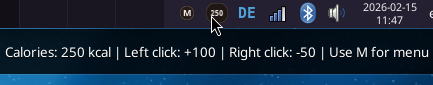
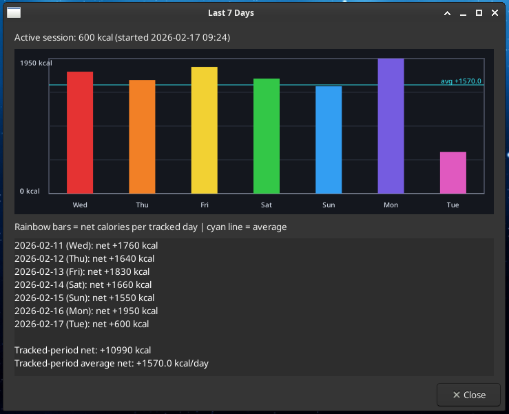

# calorieCounter

Small XFCE tray widget for tracking calories.

## Screenshots
### Tray icon


### Last 7 days overview


## Behavior
- Main calorie icon:
  - Left click adds the configured amount (default `+50 kcal`).
  - Right click subtracts the configured amount (default `-10 kcal`), clamped at `0`.
- Separate `M` icon:
  - Click to open the menu.
  - Menu items: `Reset`, `View Log`, `View Last Week`, `Clear Log`, `View Archive`, `Clear Archive`, `Adjust Click Amounts`, `Quit`.
- `Reset` sets the current value to `0`, starts a new session, and writes a `reset` event.
  - If writing the reset event fails, reset is aborted to avoid data loss.
- Events are stored as `init`, `add`, `subtract`, and `reset` with timestamps and totals.
- On first launch with no existing log, the app writes one baseline `init` event (`delta=0`, total from current state).
- The active log is automatically pruned to the last 7 days.
- Entries older than 7 days are archived before pruning.
- Archive retention is capped at about 3 months.
- `View Last Week` shows per-day net values (up to the last 7 days) and a rainbow bar chart.
  - The dialog also shows current active-session calories at the top.
  - One bar is shown per tracked day.
  - Bar height represents that day's net kcal.
- Value persists across app restarts and PC reboots.
- `View Log` shows detailed events from the active 7-day log.
- `View Archive` shows archived events in the same human-readable format as `View Log`.
- `Clear Log` clears the active log after confirmation.
- `Clear Archive` clears archived entries after confirmation.
- Only one app instance is allowed; a second launch exits and logs an error.
- State saves are atomic to reduce corruption risk on interruption.


## Dependencies (Debian/XFCE)
```bash
sudo apt install -y python3-gi python3-gi-cairo gir1.2-gtk-3.0
```

## Install
```bash
git clone https://github.com/arch-Ada/calorieCounter.git calorieCounter
cd calorieCounter
sudo apt install -y python3-gi python3-gi-cairo gir1.2-gtk-3.0
python3 calorie_widget.py
```

## Run
```bash
python3 [...path/to/calorieCounter/]calorie_widget.py
```

## Start on login (XFCE)
Use one of these:

1. GUI method:
- Open `Settings` -> `Session and Startup` -> `Application Autostart`
- Click `Add`
- Name: `calorieCounter`
- Command: `python3 [...path/to/calorieCounter/]calorie_widget.py`

2. Manual `.desktop` file:
```bash
mkdir -p ~/.config/autostart
cat > ~/.config/autostart/calorieCounter.desktop <<'EOF'
[Desktop Entry]
Type=Application
Name=calorieCounter
Exec=python3 [...path/to/calorieCounter/]calorie_widget.py
X-GNOME-Autostart-enabled=true
Terminal=false
EOF
```

## Architecture
- `calorie_widget.py`
  - GTK tray UI, menu/actions, dialogs, icon rendering, weekly bar drawing.
  - Orchestrates app flow and delegates persistence/summary logic.
- `storage.py`
  - State persistence (`state.json`), active log writes/reads/pruning, archive writes/reads/pruning.
  - Single-instance file lock handling.
  - Atomic file-write helpers.
- `weekly.py`
  - Builds the "Last 7 Days" summary text and per-day bar data from log events.

### Data flow
1. User action (click/menu) is handled in `calorie_widget.py`.
2. Event/state changes are written through `CalorieStorage` in `storage.py`.
3. Weekly view requests summary data from `weekly.py`, which reads recent events via storage.
4. UI renders summary text + rainbow bar chart in `calorie_widget.py`.

## Persistence files
- Current value:
```bash
~/.local/state/calorieCounter/state.json
```
- Active event log (last 7 days retained):
```bash
~/.local/state/calorieCounter/session_log.jsonl
```
- Archived event log (older than 7 days):
```bash
~/.local/state/calorieCounter/log_archive.jsonl
```
- Single-instance lock:
```bash
~/.local/state/calorieCounter/app.lock
```

## Logging
- Filesystem/persistence failures are logged to stderr via Python logging.

## License
- This project is licensed under GNU GPL-3.0-or-later.
- See `LICENSE` for the full text.

## Changelog
- See `CHANGELOG.md`.

```
